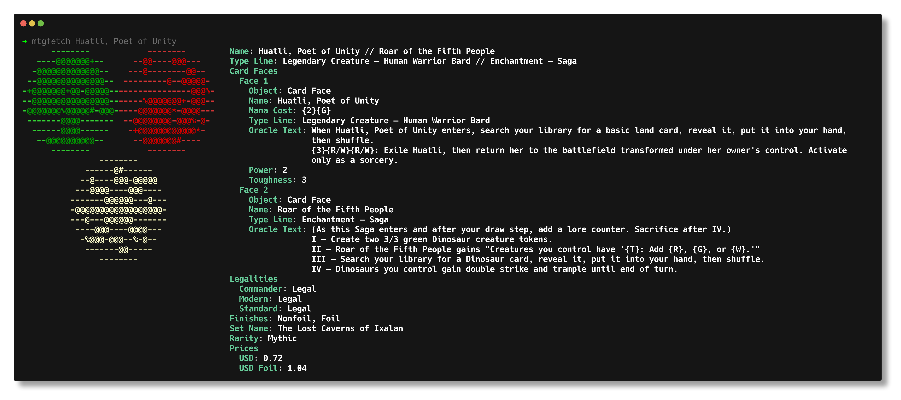
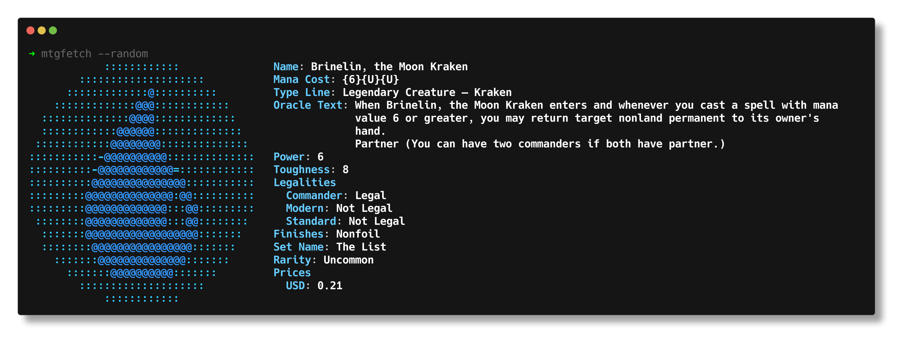

# MTGFETCH

**mtgfetch** is a command line tool which displays information on a single (*for now*) Magic: The Gathering card. It
offers some customizability in its output which can be set in the `config.yaml`
file. [Scryfall's](https://scryfall.com/) API is used in order to get card information. Currently, only Linux is
supported, but Windows and macOS support is in the works.






## Features

- Get information on any Magic: The Gathering card
- Get information on a random card
- Customizable output
    - Display only the information you want
    - Choose the color of label and text

## Installation

### Ubuntu

First, download the .deb file from the releases page

#### Graphical

- Go to the directory where the .deb package was downloaded to
- Double-click the .deb package and follow GUI installation steps

#### Terminal

- cd into the directory where the file was downloaded to
- run `sudo apt install ./mtgfetch-0.1-x86_64.deb`

### Fedora

First, download the .rpm file from the releases page

#### Graphical

- Go to the directory where the .rpm package was downloaded to
- Double-click the .rpm package and follow GUI installation steps

#### Terminal

- cd into the directory where the file was downloaded to
- run `sudo apt install ./mtgfetch-0.1-x86_64.rpm`

### From Source

If you'd like to build from source, or if you run a linux distribution that doesn't support .deb or .rpm files, these
are the steps

#### Prerequisites

Get the following packages from your package manager

```
cmake
git
g++
libssl-dev (ubuntu) / openssl-devel (fedora)
```

#### Installation Steps

1. Clone the project and enter the project directory

```shell
git clone https://github.com/monteluka/mtgfetch.git
cd mtgfetch
```

2. Build the project

```shell
mkdir build
cd build
cmake -DCMAKE_BUILD_TYPE=Release ..
cmake --build . --target mtgfetch
```

3. Now that the project files have been built, run the following command to install the program

```shell
sudo cmake --install .
```

## Uninstall

### Ubuntu

Run `sudo apt remove mtgfetch`

### Fedora

Run `sudo dnf remove mtgfetch`

### Other Linux Distro

Run the following commands. Make sure to double-check commands as we are deleting things as root.

```shell
sudo rm /usr/local/bin/mtgfetch
sudo rm -rf /usr/local/share/mtgfetch
sudo rm /etc/bash_completion.d/mtgfetch
```

## Configuration

mtgfetch uses a yaml file for storing its configuration. The program looks for the file at the directory
`~/.config/mtgfetch`. The configuration file must be named `config.yaml`. You can generate a config file using either
`mtgfetch --gen-config` or `mtgfetch --gen-config-all`. The former generate a default config which should be suitable
for most users. The latter generates a config with all available modules. There are two sections to the configuration
file. These sections are **options** and **modules**. Values that don't exist in a card but are set in your config are
simply skipped. An example of this is if you have `power` and `toughness` enabled in your config, but you search for
information on a planeswalker. Since a planeswalker doesn't have those attributes, power and toughness won't show in
your output.

### Options

The first section is called options. This section contains settings for customizing the output of the program. Options
has the following subsections.

#### Formatting

| Setting       | Value | Default Value | Description                                                      |
|---------------|-------|---------------|------------------------------------------------------------------|
| indent_length | int   | 2             | Sets the indent length of the sections and subsections in output |

#### Color

| Setting       | Value | Default Value | Description                                                                                                                                                                                                                                                                                |
|---------------|-------|---------------|--------------------------------------------------------------------------------------------------------------------------------------------------------------------------------------------------------------------------------------------------------------------------------------------|
| enabled       | bool  | true          | If set to true, output will have colored text by using ANSI color codes. At minimum, the mana symbols are colorized. If color options are set for `set_key_color` and `set_val_color` then those are colorized as well. If this option is set to false, then plain text will be outputted. |
| set_key_color | 0-255 |               | Sets the color for the labels in output. There are 256 color options to choose from. An image with all color options can be found [here](https://user-images.githubusercontent.com/208617/147884040-8fc1e280-48fb-4ac6-9296-74ba3e29ee20.png).                                             |
| set_val_color | 0-255 |               | Sets the color for the descriptive text in output. There are 256 color options to choose from. An image with all color options can be found [here](https://user-images.githubusercontent.com/208617/147884040-8fc1e280-48fb-4ac6-9296-74ba3e29ee20.png).                                   |

### Modules

The second section is called modules. It contains the names of the pieces of card information we can get. Since we are
using Scryfall's api you can have a look at their docs [here](https://scryfall.com/docs/api/cards) to see what each label represents. If you are still
confused on what some of the labels mean, then you should run the program using the config generated from
`mtgfetch --gen-config-all` to see what each label outputs.

### Customizing Order of Output

All top level values under modules can be arranged in the order you want for your output. It's important to note that
some values in the list are arrays and have their own set of possible values. An example of this is `card_faces` which
can be seen in the files [default_config.yaml](./presets/default_config.yaml)
and [all_modules.yaml](./presets/all_modules.yaml). These arrays have their own set of available values that can also be
set in any order you want. Take a look at both files to see how the `card_faces` array was rearranged.

## Usage

Run `mtgfetch --help` for usage details

## Features/Bug

- If there is a feature you want added, please open a feature
  request [here](https://github.com/monteluka/mtgfetch/issues)
- If there are any bugs you encounter, please report them [here](https://github.com/monteluka/mtgfetch/issues)